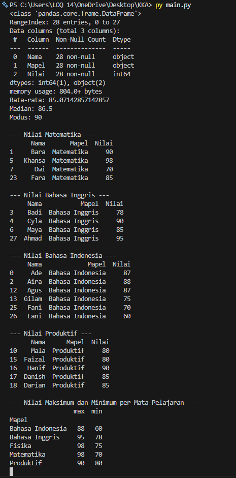

# Jawaban
# 
#Analisis dan Pertanyaan
#
## Soal 1
### Fisika
## Soal 2
###  Bahasa Indonesia
## Soal 3
### Dengan Visualisasi kita lebih mudah memahami data karena disajikan dalam bentuk grafik yang menarik dan informatif.
#
#Refleksi Siswa
#
## 1
### Cara membuat visualisasi data, dengan menggunakan visualisasi data, kita dapat dengan mudah mengidentifikasi pola, tren, dan outlier dalam data nilai.
## 2
### Kesulitan dalam bagaimana memahami cara kerja fungsi dalam membuat grafik
## 3
### Ai yang paling membantu dalam analysis data adalah ChatGPT, dan QWEEN, karena memberikan analysis data yang hampir lengkap dan mudah di pahami.

# Hasil Output

## 📊 Grafik

---

## 🧩 Cuplikan Kode

